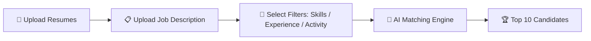

<div align="center">


# Hey there! I'm Mohamed Irfan Shafi 👋🤖


<a href="mailto:irfanshafi210608@gmail.com"></a>
<a href="https://github.com/irfanshafi21"></a>


</div>

---

## 🧠 About Me

```
🤖 role         : AI/ML Engineer
🔭 building     : Intelligent Candidate Discovery System
🌱 learning     : Deep Learning & Neural Networks
🤝 open to      : AI/ML Collaborations
📫 contact      : irfanshafi210608@gmail.com
⚡ fun fact     : I turn messy resumes into ranked shortlists!
```

---

## 🛠️ Tech Stack

<p align="center">
  
</p>

<p align="center">
  
  
  
  
</p>

---

## 🎯 Featured Project — Intelligent Candidate Discovery 🕵️‍♂️

> 🧩 An AI system that finds the **top 10 best-fit candidates** for any job — automatically!

### 🔄 How It Works



### ✨ Key Features
- 📥 **Bulk Resume Upload** — process multiple resumes at once
- 🧾 **JD-Based Matching** — match against a real job description, not just keywords
- ⚙️ **Custom Filters** — weigh by Skills, Experience, or Activity
- 🧠 **Smart Ranking Engine** — AI scores and ranks every candidate
- 🏆 **Top 10 Output** — get your shortlist instantly

**Built with:** `Python` 🐍 · `NLP` 💬 · `Machine Learning` 🤖 · `Pandas` 🐼

<p align="center">

</p>

---

## 📊 GitHub Stats

<p align="center">


</p>

<p align="center">

</p>

<p align="center">

</p>


<div align="center">
<b>🚀 Thanks for visiting — let's build something intelligent together!</b>
</div>
